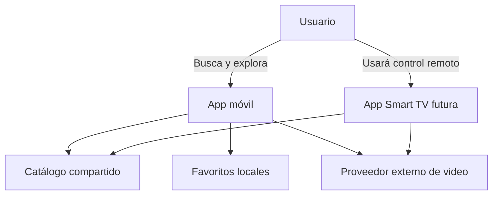

# Sabores y Saberes — aplicación móvil (MVP)

Proyecto académico Android desarrollado con Kotlin, Jetpack Compose, MVVM, Coroutines, StateFlow, Navigation y DataStore. Incluye los módulos compartibles `core`, `domain` y `data`; posteriormente se puede agregar `tv` sin duplicar modelos ni lógica.

## Cómo abrirlo

1. Descomprime el ZIP.
2. En Android Studio selecciona **Open** y elige la carpeta `SaboresYSaberes-Mobile`.
3. Espera la sincronización de Gradle.
4. Crea o selecciona un emulador con Android 7.0 (API 24) o superior.
5. Ejecuta la configuración `mobile`.

No se necesitan claves, cuenta, base de datos externa ni servidor. La primera sincronización de Gradle sí requiere internet.

## 1. Problema que resuelve

La información sobre cocina tradicional mexicana suele encontrarse dispersa y sin una presentación sencilla para consulta móvil. Esto dificulta que estudiantes y público general conozcan no solo una receta, sino también su procedencia y significado cultural. La aplicación concentra una muestra pequeña y accesible de platillos de cinco regiones.

## 2. Objetivo general

Desarrollar una aplicación móvil y, en una segunda etapa, una aplicación para Smart TV que faciliten la difusión y preservación de información básica sobre platillos tradicionales mexicanos mediante un catálogo visual, claro y fácil de explorar.

## 3. Objetivos específicos

- Mostrar nombre, región, descripción, ingredientes, preparación e importancia cultural.
- Permitir búsqueda por nombre o región y filtrado regional.
- Guardar favoritos localmente en el teléfono.
- Abrir contenido audiovisual cuando esté disponible.
- Reutilizar modelos, repositorios y casos de uso entre móvil y TV.
- Mantener una interfaz diferente y apropiada para cada dispositivo.

## 4. Alcance

El MVP contiene cinco regiones (Oaxaca, Yucatán, Puebla, Jalisco y Michoacán), diez platillos precargados, catálogo, búsqueda, filtros, detalle, favoritos persistentes y enlaces de video opcionales. El contenido local permite demostrar el proyecto sin desplegar un backend.

## 5. Limitaciones

- Muestra cultural deliberadamente pequeña; no representa toda la gastronomía mexicana.
- Los datos no se editan desde la aplicación.
- Los favoritos solo existen en el dispositivo y no se sincronizan.
- Los videos se abren con una aplicación externa y requieren internet.
- Las ilustraciones del MVP son composiciones gráficas/emoji, no fotografías documentales.
- No incluye autenticación, pagos, comentarios, redes sociales, IA ni panel administrativo.

## 6. Usuarios del sistema

- Público general interesado en gastronomía y cultura mexicana.
- Estudiantes y docentes que necesiten una introducción visual.
- Familias o visitantes que deseen explorar platillos regionales.

No se necesitan roles porque todos los usuarios consultan el mismo contenido.

## 7. Funciones principales

Catálogo, búsqueda, filtro por región, detalle cultural y culinario, favoritos y apertura de videos. Se dejan fuera perfiles, comentarios, calificaciones, notificaciones y administración porque no ayudan de forma directa al objetivo del MVP.

## 8. Arquitectura propuesta

Se usa MVVM con separación por capas:

- UI Compose: pantallas y estado visual.
- ViewModel: filtros, búsqueda y acciones del usuario mediante StateFlow.
- Domain: contratos de repositorio y casos de uso.
- Data: repositorio local, persistencia de favoritos y contrato remoto futuro.
- Core: modelos comunes.

El flujo de dependencias es `mobile → domain/data → core`. El futuro módulo `tv` dependerá de las mismas capas compartidas y tendrá su propia UI y ViewModels cuando la interacción lo requiera.

## 9. Módulos

| Módulo | Responsabilidad |
|---|---|
| `mobile` | Activity, navegación, pantallas Compose y ViewModel móvil |
| `core` | `Dish`, `Region` y utilidades compartidas |
| `domain` | Repositorio abstracto y casos de uso |
| `data` | Contenido local, DataStore, implementación del repositorio y contrato Retrofit |
| `tv` (segunda entrega) | Pantallas Compose for TV y navegación con control remoto |

## 10. Modelo de datos

`Dish` contiene: `id`, `name`, `region`, `shortDescription`, lista de `ingredients`, pasos de `preparation`, `culturalHistory`, `imageKey` y `videoUrl` opcional. `Region` es un enum limitado a cinco valores. Los favoritos se almacenan como un conjunto de IDs; no se requiere una entidad de usuario.

## 11. Diagrama de contexto



## 12. Flujo de funcionamiento

1. La aplicación carga el catálogo local por medio del repositorio.
2. El ViewModel combina catálogo, texto de búsqueda, región y favoritos.
3. La interfaz observa el resultado mediante StateFlow.
4. El usuario abre un platillo y consulta toda su información.
5. Si lo marca como favorito, DataStore conserva el ID.
6. Si existe video, Android abre el enlace con una aplicación compatible.

## 13. Pantallas móviles necesarias

Solo se usan dos destinos principales:

1. **Catálogo**, que integra búsqueda, chips regionales y pestaña de favoritos.
2. **Detalle**, con imagen ilustrativa, descripción, ingredientes, preparación, historia y botón de video.

No es necesaria una pantalla separada por región ni una pantalla independiente de búsqueda: integrarlas en el catálogo reduce alcance y navegación.

## 14. Pantallas de Smart TV necesarias

Para la segunda etapa bastan tres:

1. Inicio/exploración con filas de platillos y regiones.
2. Detalle del platillo, diseñado para verse a distancia.
3. Reproductor o lanzamiento de video.

Favoritos y teclado de búsqueda pueden omitirse inicialmente en TV para simplificar la interacción con control remoto.

## 15. Estructura de Android Studio

```text
SaboresYSaberes/
├── mobile/
│   └── src/main/java/.../mobile/
│       ├── MainActivity.kt
│       ├── SaboresApplication.kt
│       └── ui/
├── core/src/main/java/.../core/model/
├── domain/src/main/java/.../domain/
├── data/src/main/java/.../data/
└── tv/                         (segunda entrega)
```

## 16. Orden recomendado de desarrollo

1. Definir regiones y contenido de muestra.
2. Crear `core` y el modelo `Dish`.
3. Crear contratos y casos de uso en `domain`.
4. Implementar datos locales y favoritos en `data`.
5. Construir catálogo y filtros en móvil.
6. Construir detalle y enlace de video.
7. Probar búsqueda, persistencia y navegación.
8. Añadir el módulo TV reutilizando las capas existentes.
9. Solo si la materia lo exige, reemplazar el origen local por una API pequeña.

## Decisiones para mantener el alcance

Retrofit se incluye como contrato preparado, pero el MVP usa datos locales. Una API real, base de datos remota, fotografías finales y reproductor integrado pueden añadirse después; no son necesarios para demostrar el objetivo cultural, la arquitectura compartida ni el funcionamiento móvil.
